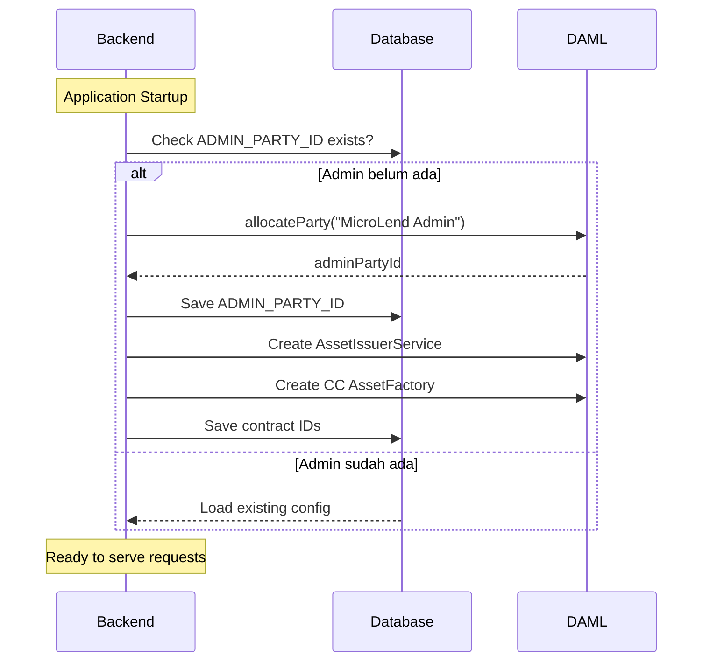
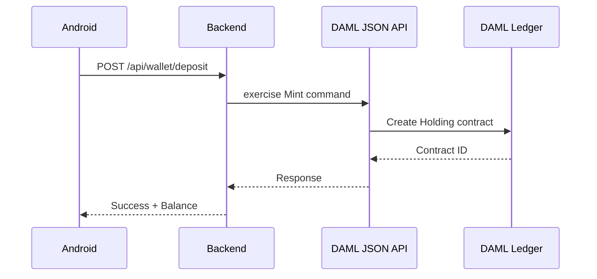

# Backend API Integration Guide: DAML Finance Module

> **Untuk:** Backend Developer  
> **Dari:** Tim MicroLend  
> **Tujuan:** Implementasi API untuk fitur Deposit dan Transfer Token

---

## Status Saat Ini

✅ **Sudah Selesai:**
- User Sign Up -> Backend allocate DAML Party ID -> Simpan di database (`damlPartyId`)
- DAML Finance module dengan: Account, AssetFactory, Holding, Transfer

📋 **Yang Perlu Dibuat:**
- **Admin Party** untuk sistem MicroLend (Bank/Issuer)
- API untuk Deposit (Mint token ke user)
- API untuk Transfer (Kirim token antar user)
- API untuk Get Balance (Cek saldo user)

---

## 🔑 PENTING: Struktur Party

### Penjelasan Party

```
┌─────────────────────────────────────────────────────────────────┐
│  ADMIN PARTY (Bank/Issuer)                                      │
│  ─────────────────────────                                      │
│  • Party ID: Dialokasikan saat backend startup                  │
│  • Role: Custodian (manage accounts) + Issuer (mint tokens)     │
│  • Authority: Create AssetFactory, Mint tokens, Manage accounts │
│  • Simpan di: Database atau Environment Variable                │
└─────────────────────────────────────────────────────────────────┘
                              │
                              │ mengelola & mint token ke
                              ▼
┌─────────────────────────────────────────────────────────────────┐
│  USER PARTIES                                                   │
│  ────────────                                                   │
│  • alice@gmail.com -> "alice_gmail::xyz789..."                  │
│  • bob@gmail.com   -> "bob_gmail::def456..."                    │
│  • (dialokasikan saat user registrasi - sudah jalan)            │
└─────────────────────────────────────────────────────────────────┘
```

| Party | Peran | Kapan Dibuat |
|-------|-------|--------------|
| **Admin** | Bank/Issuer - mint tokens, manage system | Sekali saat backend startup |
| **User** | End user - punya balance, bisa transfer | Saat user registrasi |

> ⚠️ **PENTING:** Admin Party HARUS dibuat sebelum bisa deposit/transfer!

---

## 0. Setup Admin Party (WAJIB - Jalankan Sekali)

### 0.1 Allocate Admin Party saat Backend Startup

Tambahkan di `DamlLedgerService.java` atau buat service baru `AdminSetupService.java`:

```java
@Service
@RequiredArgsConstructor
public class AdminSetupService {

    private final DamlLedgerService damlService;
    
    // Simpan ke database atau config
    private String adminPartyId;
    private String assetFactoryContractId;
    private String issuerServiceContractId;

    /**
     * Jalankan sekali saat aplikasi startup.
     * Bisa dipanggil dari @PostConstruct atau ApplicationRunner.
     */
    @PostConstruct
    public void initializeAdminParty() {
        // 1. Cek apakah admin sudah ada di database
        Optional<SystemConfig> existingAdmin = configRepository.findByKey("ADMIN_PARTY_ID");
        
        if (existingAdmin.isPresent()) {
            // Admin sudah ada, load dari database
            this.adminPartyId = existingAdmin.get().getValue();
            this.assetFactoryContractId = configRepository.findByKey("CC_FACTORY_CONTRACT_ID")
                .map(SystemConfig::getValue).orElse(null);
            log.info("Loaded existing admin party: {}", adminPartyId);
            return;
        }
        
        // 2. Allocate admin party baru
        this.adminPartyId = damlService.allocateParty("MicroLend Admin", "microlend_admin");
        
        // 3. Simpan ke database
        configRepository.save(new SystemConfig("ADMIN_PARTY_ID", adminPartyId));
        
        log.info("Created new admin party: {}", adminPartyId);
        
        // 4. Setup AssetIssuerService dan AssetFactory
        setupAssetFactory();
    }

    private void setupAssetFactory() {
        // Create AssetIssuerService
        CreateResponse issuerResponse = damlService.createContract(
            "MicroLend.Finance.Asset:AssetIssuerService",
            Map.of(
                "issuer", adminPartyId,
                "observers", List.of()
            )
        );
        this.issuerServiceContractId = issuerResponse.contractId();
        
        // Create CC Token Factory
        ExerciseResponse factoryResponse = damlService.exerciseChoice(
            "MicroLend.Finance.Asset:AssetIssuerService",
            issuerServiceContractId,
            "CreateCCFactory",
            Map.of("maxSupply", null)  // unlimited supply
        );
        
        // Factory contract ID dari response
        this.assetFactoryContractId = extractContractId(factoryResponse);
        
        // Simpan ke database
        configRepository.save(new SystemConfig("CC_FACTORY_CONTRACT_ID", assetFactoryContractId));
        configRepository.save(new SystemConfig("ISSUER_SERVICE_CONTRACT_ID", issuerServiceContractId));
        
        log.info("Created CC AssetFactory: {}", assetFactoryContractId);
    }
    
    // Getters untuk digunakan WalletService
    public String getAdminPartyId() { return adminPartyId; }
    public String getAssetFactoryContractId() { return assetFactoryContractId; }
}
```

### 0.2 SystemConfig Entity (untuk menyimpan config)

```java
@Entity
@Table(name = "system_config")
@Data
@NoArgsConstructor
@AllArgsConstructor
public class SystemConfig {
    
    @Id
    @Column(name = "config_key")
    private String key;
    
    @Column(name = "config_value")
    private String value;
}
```

### 0.3 Repository

```java
@Repository
public interface SystemConfigRepository extends JpaRepository<SystemConfig, String> {
    Optional<SystemConfig> findByKey(String key);
}
```

### Alur Setup Admin



---

## Arsitektur



---

## DAML JSON API Endpoints

Backend berkomunikasi dengan DAML via **JSON API** (sudah ada di `DamlLedgerService.java`).

| Endpoint | Method | Fungsi |
|----------|--------|--------|
| `/v1/create` | POST | Create new contract |
| `/v1/exercise` | POST | Exercise choice on contract |
| `/v1/query` | POST | Query contracts |
| `/v1/fetch` | POST | Fetch specific contract |

---

## 1. Setup Awal (One-Time)

Sebelum user bisa deposit/transfer, perlu setup:

### 1.1 Create AssetIssuerService (Admin/Bank setup)

```bash
# Jalankan sekali saat sistem startup
POST /v1/create
Authorization: Bearer {admin_jwt_token}
Content-Type: application/json

{
  "templateId": "MicroLend.Finance.Asset:AssetIssuerService",
  "payload": {
    "issuer": "Bank::1234567890abcdef",
    "observers": []
  }
}
```

### 1.2 Create AssetFactory untuk CC Token

```bash
POST /v1/exercise
Authorization: Bearer {admin_jwt_token}
Content-Type: application/json

{
  "templateId": "MicroLend.Finance.Asset:AssetIssuerService",
  "contractId": "#issuer_service_contract_id",
  "choice": "CreateCCFactory",
  "argument": {
    "maxSupply": null
  }
}
```

> **Simpan contract ID AssetFactory di database atau config!**

---

## 2. API: Deposit (Mint Token ke User)

### Endpoint
```
POST /api/wallet/deposit
```

### Request Body
```json
{
  "amount": 100000.00,
  "currency": "CC"
}
```

### Backend Logic

```java
@RestController
@RequestMapping("/api/wallet")
@RequiredArgsConstructor
public class WalletController {

    private final WalletService walletService;

    @PostMapping("/deposit")
    public ResponseEntity<DepositResponse> deposit(
            @AuthenticationPrincipal UserDetails user,
            @RequestBody DepositRequest request) {
        
        DepositResponse response = walletService.deposit(
            user.getUsername(),  // email
            request.getAmount(),
            request.getCurrency()
        );
        return ResponseEntity.ok(response);
    }
}
```

### WalletService.java (New Service)

```java
@Service
@RequiredArgsConstructor
public class WalletService {

    private final DamlLedgerService damlService;
    private final UserRepository userRepository;
    
    // Contract ID AssetFactory - simpan di config atau database
    private String ccFactoryContractId;

    public DepositResponse deposit(String email, BigDecimal amount, String currency) {
        // 1. Get user's DAML Party ID
        Users user = userRepository.findByEmail(email)
            .orElseThrow(() -> new NotFoundException("User not found"));
        
        String userPartyId = user.getDamlPartyId();
        
        // 2. Exercise Mint on AssetFactory
        DamlExerciseResponse response = damlService.exerciseChoice(
            "MicroLend.Finance.Asset:AssetFactory",
            ccFactoryContractId,
            "Mint",
            Map.of(
                "recipient", userPartyId,
                "mintAmount", amount.toString()
            )
        );
        
        // 3. Update factory contract ID (karena consuming choice)
        // Response berisi tuple: (newFactoryId, holdingId)
        this.ccFactoryContractId = response.getResult().get(0);
        String holdingContractId = response.getResult().get(1);
        
        // 4. Simpan holding ID ke database (optional)
        // ...
        
        return new DepositResponse(holdingContractId, amount, currency);
    }
}
```

### DAML JSON API Request untuk Mint

```json
POST /v1/exercise
Authorization: Bearer {user_or_admin_jwt_token}

{
  "templateId": "MicroLend.Finance.Asset:AssetFactory",
  "contractId": "#asset_factory_contract_id",
  "choice": "Mint",
  "argument": {
    "recipient": "user_party_id::1234567890abcdef",
    "mintAmount": "100000.0"
  }
}
```

### Response
```json
{
  "status": 200,
  "result": {
    "exerciseResult": ["#new_factory_id", "#holding_id"],
    "events": [...]
  }
}
```

---

## 3. API: Transfer Token

### Endpoint
```
POST /api/wallet/transfer
```

### Request Body
```json
{
  "recipientEmail": "bob@example.com",
  "amount": 50000.00,
  "currency": "CC",
  "note": "Payment for services"
}
```

### Backend Logic

```java
public TransferResponse transfer(String senderEmail, TransferRequest request) {
    // 1. Get sender and receiver party IDs
    Users sender = userRepository.findByEmail(senderEmail)
        .orElseThrow(() -> new NotFoundException("Sender not found"));
    Users receiver = userRepository.findByEmail(request.getRecipientEmail())
        .orElseThrow(() -> new NotFoundException("Recipient not found"));
    
    String senderPartyId = sender.getDamlPartyId();
    String receiverPartyId = receiver.getDamlPartyId();
    
    // 2. Query sender's holding
    List<HoldingContract> holdings = damlService.queryContracts(
        "MicroLend.Finance.Holding:Holding",
        Map.of("owner", senderPartyId)
    );
    
    if (holdings.isEmpty()) {
        throw new InsufficientBalanceException("No balance found");
    }
    
    // 3. Find holding with sufficient balance
    HoldingContract holding = findHoldingWithBalance(holdings, request.getAmount());
    
    // 4. Split if needed, then Transfer
    if (holding.getAmount().compareTo(request.getAmount()) > 0) {
        // Split first
        DamlExerciseResponse splitResponse = damlService.exerciseChoice(
            "MicroLend.Finance.Holding:Holding",
            holding.getContractId(),
            "Split",
            Map.of("splitAmount", request.getAmount().toString())
        );
        
        String splitHoldingId = splitResponse.getResult().get(0);
        
        // Transfer the split portion
        damlService.exerciseChoice(
            "MicroLend.Finance.Holding:Holding",
            splitHoldingId,
            "Transfer",
            Map.of("newOwner", receiverPartyId)
        );
    } else {
        // Transfer entire holding
        damlService.exerciseChoice(
            "MicroLend.Finance.Holding:Holding",
            holding.getContractId(),
            "Transfer",
            Map.of("newOwner", receiverPartyId)
        );
    }
    
    return new TransferResponse("SUCCESS", request.getAmount());
}
```

### DAML JSON API - Split + Transfer

**Step 1: Split**
```json
POST /v1/exercise
{
  "templateId": "MicroLend.Finance.Holding:Holding",
  "contractId": "#sender_holding_id",
  "choice": "Split",
  "argument": {
    "splitAmount": "50000.0"
  }
}
```

**Step 2: Transfer**
```json
POST /v1/exercise
{
  "templateId": "MicroLend.Finance.Holding:Holding",
  "contractId": "#split_holding_id",
  "choice": "Transfer",
  "argument": {
    "newOwner": "receiver_party_id::abcdef1234567890"
  }
}
```

---

## 4. API: Get Balance

### Endpoint
```
GET /api/wallet/balance
```

### Backend Logic

```java
public BalanceResponse getBalance(String email) {
    Users user = userRepository.findByEmail(email)
        .orElseThrow(() -> new NotFoundException("User not found"));
    
    // Query all holdings owned by user
    List<HoldingContract> holdings = damlService.queryContracts(
        "MicroLend.Finance.Holding:Holding",
        Map.of("owner", user.getDamlPartyId())
    );
    
    // Sum up balances by currency
    Map<String, BigDecimal> balances = new HashMap<>();
    for (HoldingContract h : holdings) {
        String symbol = h.getAssetId().getSymbol();
        balances.merge(symbol, h.getAmount(), BigDecimal::add);
    }
    
    return new BalanceResponse(balances);
}
```

### DAML JSON API - Query Holdings

```json
POST /v1/query
Authorization: Bearer {user_jwt_token}

{
  "templateIds": ["MicroLend.Finance.Holding:Holding"],
  "query": {
    "owner": "user_party_id::1234567890abcdef"
  }
}
```

### Response
```json
{
  "status": 200,
  "result": [
    {
      "contractId": "#holding_id_1",
      "payload": {
        "custodian": "Bank::...",
        "owner": "user_party_id::...",
        "assetId": {
          "issuer": "Bank::...",
          "symbol": "CC",
          "description": "Canton Coin Token"
        },
        "amount": "100000.0",
        "observers": []
      }
    }
  ]
}
```

---

## 5. DamlLedgerService Extensions

Tambahkan method baru di `DamlLedgerService.java`:

```java
/**
 * Exercise a choice on a contract
 */
public ExerciseResponse exerciseChoice(
        String templateId, 
        String contractId, 
        String choice, 
        Map<String, Object> argument) {
    
    ExerciseRequest request = new ExerciseRequest(templateId, contractId, choice, argument);
    
    return webClient.post()
        .uri("/v1/exercise")
        .header("Authorization", "Bearer " + getUserToken())
        .contentType(MediaType.APPLICATION_JSON)
        .bodyValue(request)
        .retrieve()
        .bodyToMono(ExerciseResponse.class)
        .block();
}

/**
 * Query contracts by template and filter
 */
public List<ContractResult> queryContracts(String templateId, Map<String, Object> query) {
    QueryRequest request = new QueryRequest(List.of(templateId), query);
    
    QueryResponse response = webClient.post()
        .uri("/v1/query")
        .header("Authorization", "Bearer " + getUserToken())
        .contentType(MediaType.APPLICATION_JSON)
        .bodyValue(request)
        .retrieve()
        .bodyToMono(QueryResponse.class)
        .block();
    
    return response.result();
}

/**
 * Create a contract
 */
public CreateResponse createContract(String templateId, Map<String, Object> payload) {
    CreateRequest request = new CreateRequest(templateId, payload);
    
    return webClient.post()
        .uri("/v1/create")
        .header("Authorization", "Bearer " + adminToken)
        .contentType(MediaType.APPLICATION_JSON)
        .bodyValue(request)
        .retrieve()
        .bodyToMono(CreateResponse.class)
        .block();
}

// DTOs
record ExerciseRequest(String templateId, String contractId, String choice, Map<String, Object> argument) {}
record ExerciseResponse(int status, ExerciseResult result) {}
record ExerciseResult(Object exerciseResult, List<Object> events) {}

record QueryRequest(List<String> templateIds, Map<String, Object> query) {}
record QueryResponse(int status, List<ContractResult> result) {}
record ContractResult(String contractId, Map<String, Object> payload) {}

record CreateRequest(String templateId, Map<String, Object> payload) {}
record CreateResponse(int status, String contractId) {}
```

---

## 6. JWT Token untuk User

Setiap user perlu JWT token untuk akses DAML. Generate saat login:

```java
public String generateDamlToken(String partyId) {
    String payload = String.format("""
        {
            "https://daml.com/ledger-api": {
                "ledgerId": "sandbox",
                "applicationId": "microlend-android",
                "actAs": ["%s"],
                "readAs": ["%s"]
            },
            "exp": %d
        }
        """, partyId, partyId, System.currentTimeMillis()/1000 + 3600);
    
    // Encode ke JWT (dengan signature jika production)
    return encodeJwt(payload);
}
```

---

## Summary: API Endpoints

| Endpoint | Method | Fungsi |
|----------|--------|--------|
| `/api/wallet/deposit` | POST | Deposit/mint token ke user |
| `/api/wallet/transfer` | POST | Transfer token ke user lain |
| `/api/wallet/balance` | GET | Get user's token balance |

---

## Checklist Implementasi

### Setup Admin (WAJIB - Sekali)
- [ ] Buat `SystemConfig` entity dan `SystemConfigRepository`
- [ ] Buat `AdminSetupService.java` dengan `@PostConstruct`
- [ ] Allocate Admin Party saat startup
- [ ] Create `AssetIssuerService` contract
- [ ] Create `CC AssetFactory` contract
- [ ] Simpan semua contract IDs ke database

### API Implementation
- [ ] Extend `DamlLedgerService.java` dengan `exerciseChoice`, `queryContracts`, `createContract`
- [ ] Tambah `WalletController.java`
- [ ] Tambah `WalletService.java`
- [ ] Tambah DTO: `DepositRequest`, `DepositResponse`, `TransferRequest`, `TransferResponse`, `BalanceResponse`

### Testing
- [ ] Test Admin Party allocation
- [ ] Test Deposit API
- [ ] Test Transfer API
- [ ] Test Balance API

