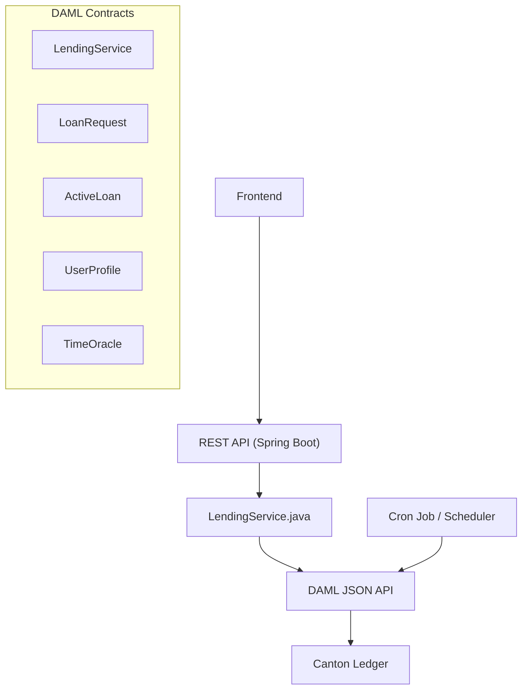

# Backend API Plan — MicroLend Lending & Borrowing


## Arsitektur Overview



> [!IMPORTANT]
> Semua interaksi dengan DAML Ledger menggunakan **DAML JSON API** via `DamlLedgerService`, sesuai pola yang sudah ada di `WalletController` → `WalletService` → `DamlLedgerService`.

---

## Template DAML yang Perlu Diakses

| DAML Template | Module Path | Signatory | Kapan Digunakan |
|---|---|---|---|
| `LendingService` | `MicroLend.Finance.Lending.LendingService` | `operator` | Membuat loan request |
| `LoanRequest` | `MicroLend.Finance.Lending.LoanRequest` | `operator, borrower` | Marketplace, fill/cancel |
| `ActiveLoan` | `MicroLend.Finance.Lending.ActiveLoan` | `operator, borrower` | Repay, liquidate |
| `UserProfile` | `MicroLend.Finance.Lending.UserProfile` | `operator` | Track user level & history |
| `UserProfileFactory` | `MicroLend.Finance.Lending.UserProfile` | `operator` | Buat profile user baru |
| `TimeOracle` | `MicroLend.Finance.Lending.TimeOracle` | `operator` | Waktu untuk validasi expiry |

---

## API Endpoints

### 1. Setup & Admin APIs

#### `POST /api/admin/lending/setup`
Inisialisasi lending system (dipanggil sekali saat deployment).

**Apa yang dilakukan:**
1. Create `LendingService` contract dengan config default
2. Create `TimeOracle` contract
3. Create `UserProfileFactory` contract

**Request Body:**
```json
{
  "baseCollateralRate": 1.10,
  "interestRate": 0.05,
  "loanDurationDays": 30
}
```

**Response:**
```json
{
  "success": true,
  "lendingServiceContractId": "00abc...",
  "timeOracleContractId": "00def...",
  "userProfileFactoryContractId": "00ghi..."
}
```

**DAML operations:**
```
createCmd LendingService { operator, baseCollateralRate, interestRate, loanDurationDays, observers: [] }
createCmd TimeOracle { operator, currentTime: now(), observers: [] }
createCmd UserProfileFactory { operator }
```

---

#### `PUT /api/admin/lending/config`
Update konfigurasi lending (base rate, interest, durasi).

**Request:**
```json
{
  "newBaseRate": 1.15,
  "newInterestRate": 0.08,
  "newDurationDays": 60
}
```

**DAML:** Exercise `UpdateServiceConfig` on `LendingService` contract.

---

### 2. User Profile APIs

#### `POST /api/lending/profile`
Buat UserProfile untuk user yang baru pertama kali pakai fitur lending. Dipanggil otomatis saat user pertama kali akses halaman lending.

**Auth:** JWT (user harus sudah login)

**DAML:** Exercise `CreateUserProfile` on `UserProfileFactory` dengan `user = partyId`

**Response:**
```json
{
  "success": true,
  "contractId": "00xyz...",
  "level": "Level1",
  "loansCompleted": 0,
  "loansDefaulted": 0,
  "totalBorrowed": 0.0,
  "totalLent": 0.0
}
```

---

#### `GET /api/lending/profile`
Ambil profil lending user saat ini.

**Auth:** JWT

**Cara mendapatkan:**
- Query active contracts dengan template `UserProfile` where `user = partyId`
- Atau exercise `GetProfileInfo` choice (non-consuming)

**Response:**
```json
{
  "level": "Level2",
  "loansCompleted": 5,
  "loansDefaulted": 0,
  "totalBorrowed": 500.0,
  "totalLent": 300.0,
  "collateralRate": 1.14,
  "collateralRateDescription": "110% base + 4% (Level2)"
}
```

> [!NOTE]
> `collateralRate` dihitung di backend: `baseCollateralRate + levelBonus`. Level bonuses: Level1=5%, Level2=4%, Level3=3%, Level4=2%, Level5=1%.

---

### 3. Loan Marketplace APIs

#### `POST /api/lending/request`
**Borrower** membuat loan request. Ini adalah endpoint utama untuk meminjam.

**Auth:** JWT (borrower)

**Request:**
```json
{
  "loanAmount": 100.0,
  "collateralHoldingContractId": "00abc..."
}
```

**Backend Flow:**
1. Get user's `UserProfile` → ambil `level`
2. Get `TimeOracle` → ambil `currentTime`
3. Get `LendingService` contract ID
4. Hitung required collateral: `loanAmount × collateralRate(level)`
5. Jika collateral holding > required → exercise `RequestLoanWithSplit` (split otomatis)
6. Jika collateral holding == required → exercise `RequestLoan`
7. **Setelah berhasil**, exercise `AddServiceObserver` untuk menambahkan borrower jika belum menjadi observer

**DAML:** Exercise `RequestLoanWithSplit` on `LendingService`

**Controller:** `operator, borrower` (submitMulti)

```json
// Choice arguments
{
  "borrower": "<party-id>",
  "loanAmount": 100.0,
  "loanAssetId": { "issuer": "<admin-party>", "symbol": "CC", "description": "Collateral Coin Token" },
  "collateralAssetId": { "issuer": "<admin-party>", "symbol": "USDx", "description": "USD Stablecoin Token" },
  "collateralHoldingCid": "<contract-id>",
  "borrowerLevel": "Level1",
  "requestTime": "2026-02-12T12:00:00Z"
}
```

> [!WARNING]
> Endpoint ini membutuhkan **submitMulti** dengan `actAs: [operator, borrower]` karena DAML choice `RequestLoan` membutuhkan kedua party sebagai controller.

**Response:**
```json
{
  "success": true,
  "loanRequestContractId": "00loan...",
  "remainderHoldingContractId": "00rem...",
  "loanDetails": {
    "loanAmount": 100.0,
    "collateralAmount": 115.0,
    "interestRate": 0.05,
    "durationDays": 30,
    "requiredRepayment": 105.0
  }
}
```

---

#### `GET /api/lending/marketplace`
List semua loan request yang tersedia di marketplace (yang bisa di-fill oleh lender).

**Auth:** JWT (any authenticated user)

**Cara mendapatkan:**
- Query active contracts template `LoanRequest`
- Filter: hanya yang user bisa lihat (user ada di observers)
- Sort by: `requestedAt` DESC (terbaru dulu)

**Response:**
```json
{
  "loanRequests": [
    {
      "contractId": "00loan1...",
      "borrower": "alice-party-id",
      "borrowerDisplayName": "Alice",
      "loanAmount": 100.0,
      "collateralAmount": 115.0,
      "loanAsset": "CC",
      "collateralAsset": "USDx",
      "interestRate": 0.05,
      "durationDays": 30,
      "borrowerLevel": "Level1",
      "requestedAt": "2026-02-12T12:00:00Z",
      "expectedRepayment": 105.0,
      "collateralRatio": 1.15
    }
  ],
  "totalCount": 1
}
```

---

#### `GET /api/lending/my-requests`
List loan request milik user (sebagai borrower).

**Auth:** JWT

**Cara:** Query `LoanRequest` where `borrower = partyId`

**Response:** Sama format seperti marketplace, tapi hanya milik user.

---

#### `POST /api/lending/request/{contractId}/fill`
**Lender** memenuhi loan request. Memberikan CC ke borrower.

**Auth:** JWT (lender)

**Request:**
```json
{
  "loanHoldingContractId": "00cc_holding..."
}
```

**DAML:** Exercise `FillLoan` on `LoanRequest` contract

```json
{
  "lender": "<lender-party-id>",
  "loanHoldingCid": "<cc-holding-contract-id>"
}
```

**Controller:** `lender` (submit biasa, bukan submitMulti)

**Response:**
```json
{
  "success": true,
  "activeLoanContractId": "00active...",
  "message": "Loan funded successfully. CC transferred to borrower."
}
```

> [!IMPORTANT]
> Setelah berhasil, backend harus update `UserProfile`:
> - Exercise `RecordLending` on lender's profile (`lentAmount = loanAmount`)

---

#### `DELETE /api/lending/request/{contractId}`
**Borrower** membatalkan loan request. Collateral USDx dikembalikan.

**Auth:** JWT (borrower)

**DAML:** Exercise `CancelRequest` on `LoanRequest`

**Controller:** `borrower`

**Response:**
```json
{
  "success": true,
  "returnedCollateralContractId": "00usdx...",
  "message": "Loan request cancelled. Collateral returned."
}
```

---

### 4. Active Loan APIs

#### `GET /api/lending/my-loans`
List semua active loan user (baik sebagai borrower maupun lender).

**Auth:** JWT

**Cara:** Query `ActiveLoan` contracts where `borrower = partyId` OR `lender = partyId`

**Response:**
```json
{
  "asBorrower": [
    {
      "contractId": "00active1...",
      "lender": "bob-party-id",
      "lenderDisplayName": "Bob",
      "loanAmount": 100.0,
      "collateralAmount": 115.0,
      "interestRate": 0.05,
      "requiredRepayment": 105.0,
      "startTime": "2026-02-01T12:00:00Z",
      "endTime": "2026-03-03T12:00:00Z",
      "status": "Active",
      "daysRemaining": 19,
      "isOverdue": false
    }
  ],
  "asLender": [
    {
      "contractId": "00active2...",
      "borrower": "alice-party-id",
      "borrowerDisplayName": "Alice",
      "loanAmount": 200.0,
      "collateralAmount": 228.0,
      "interestRate": 0.05,
      "expectedReturn": 210.0,
      "startTime": "2026-01-15T12:00:00Z",
      "endTime": "2026-02-14T12:00:00Z",
      "status": "Active",
      "daysRemaining": 2,
      "isOverdue": false,
      "canLiquidate": false
    }
  ]
}
```

> [!NOTE]
> `daysRemaining` dan `isOverdue` dihitung di backend berdasarkan `TimeOracle.currentTime` vs `endTime`. `canLiquidate` = `currentTime > endTime`.

---

#### `POST /api/lending/loan/{contractId}/repay`
**Borrower** membayar pinjaman. CC (principal + interest) dikirim ke lender, USDx collateral dikembalikan.

**Auth:** JWT (borrower)

**Request:**
```json
{
  "repaymentHoldingContractId": "00cc_repay..."
}
```

**Validasi Backend (sebelum submit ke DAML):**
1. Ambil `ActiveLoan` contract → hitung `requiredRepayment = loanAmount × (1 + interestRate)`
2. Fetch repayment holding → cek `amount >= requiredRepayment`
3. Jika holding amount > requiredRepayment → split dulu (exercise `Split` on Holding)

**DAML:** Exercise `Repay` on `ActiveLoan`

**Controller:** `borrower`

**Response:**
```json
{
  "success": true,
  "repaidHoldingContractId": "00cc_to_lender...",
  "returnedCollateralContractId": "00usdx_back...",
  "repaymentAmount": 105.0,
  "collateralReturned": 115.0,
  "message": "Loan repaid successfully. Collateral returned."
}
```

> [!IMPORTANT]
> Setelah berhasil, backend harus:
> 1. Exercise `RecordLoanCompletion` on borrower's `UserProfile` (`loanAmount`)
> 2. Evaluasi apakah perlu upgrade level (misal: setiap 5 loans completed → upgrade)

---

#### `POST /api/lending/loan/{contractId}/liquidate`
**Lender** mengklaim collateral karena pinjaman sudah jatuh tempo (expired).

**Auth:** JWT (lender)

**Validasi Backend:**
1. Get `TimeOracle` → `currentTime`
2. Get `ActiveLoan` → `endTime`
3. Pastikan `currentTime > endTime` (sudah expired)

**DAML:** Exercise `Liquidate` on `ActiveLoan`

```json
{
  "currentTime": "2026-03-04T12:00:00Z"
}
```

**Controller:** `lender`

**Response:**
```json
{
  "success": true,
  "claimedCollateralContractId": "00usdx_claimed...",
  "collateralAmount": 115.0,
  "message": "Loan liquidated. Collateral claimed."
}
```

> [!IMPORTANT]
> Setelah berhasil, backend harus:
> 1. Exercise `RecordDefault` on borrower's `UserProfile`
> 2. Evaluasi apakah perlu downgrade level borrower

---

### 5. Time Oracle (Cron Job)

#### Scheduled Task — `TimeOracleScheduler`

**Bukan REST API**, tapi **scheduled task** (`@Scheduled`) yang berjalan setiap **1 menit**.

```java
@Scheduled(fixedRate = 60000) // setiap 1 menit
public void updateTimeOracle() {
    // 1. Query TimeOracle contract
    // 2. Exercise UpdateTime with newTime = Instant.now()
}
```

**DAML:** Exercise `UpdateTime` on `TimeOracle`

**Controller:** `operator`

> [!CAUTION]
> TimeOracle **harus selalu up-to-date**. Jika cron mati, fitur liquidation tidak bisa berfungsi karena waktu tidak ter-update. Pastikan ada monitoring/alerting untuk cron ini.

---

### 6. Dashboard / Statistics APIs

#### `GET /api/lending/stats`
Statistik lending platform (untuk admin dashboard).

**Auth:** JWT (admin only)

**Response:**
```json
{
  "totalActiveLoanRequests": 15,
  "totalActiveLoans": 42,
  "totalLoanVolume": 25000.0,
  "totalCollateralLocked": 28750.0,
  "averageInterestRate": 0.05,
  "defaultRate": 0.02,
  "usersByLevel": {
    "Level1": 120,
    "Level2": 45,
    "Level3": 18,
    "Level4": 5,
    "Level5": 2
  }
}
```

---

## Referensi Penting

### submitMulti vs submit

| Endpoint | Submit Type | actAs Parties |
|---|---|---|
| `POST /request` (RequestLoan) | **submitMulti** | `operator, borrower` |
| `POST /fill` (FillLoan) | submit | `lender` |
| `DELETE /request` (CancelRequest) | submit | `borrower` |
| `POST /repay` (Repay) | submit | `borrower` |
| `POST /liquidate` (Liquidate) | submit | `lender` |
| All admin endpoints | submit | `operator` |
| TimeOracle update | submit | `operator` |

### Collateral Rate Reference

| User Level | Base Rate | Bonus | Total Collateral Rate |
|---|---|---|---|
| Level1 (New user) | 110% | +5% | **115%** |
| Level2 | 110% | +4% | **114%** |
| Level3 | 110% | +3% | **113%** |
| Level4 | 110% | +2% | **112%** |
| Level5 (Trusted) | 110% | +1% | **111%** |

### AssetId Format

Semua asset ID menggunakan format yang sudah ada:
```json
{
  "issuer": "<admin-party-id>",
  "symbol": "CC",           // atau "USDx"
  "description": "Collateral Coin Token"  // atau "USD Stablecoin Token"
}
```

### File Reference
- [LendingService.daml](file:///Users/apple/Desktop/KucingOyen/MicroLend-KucingOyen/MicroLend/daml/MicroLend/Finance/Lending/LendingService.daml) — Entry point, `RequestLoan` / `RequestLoanWithSplit`
- [LoanRequest.daml](file:///Users/apple/Desktop/KucingOyen/MicroLend-KucingOyen/MicroLend/daml/MicroLend/Finance/Lending/LoanRequest.daml) — `FillLoan`, `CancelRequest`
- [ActiveLoan.daml](file:///Users/apple/Desktop/KucingOyen/MicroLend-KucingOyen/MicroLend/daml/MicroLend/Finance/Lending/ActiveLoan.daml) — `Repay`, `Liquidate`
- [UserProfile.daml](file:///Users/apple/Desktop/KucingOyen/MicroLend-KucingOyen/MicroLend/daml/MicroLend/Finance/Lending/UserProfile.daml) — Level tracking, history
- [TimeOracle.daml](file:///Users/apple/Desktop/KucingOyen/MicroLend-KucingOyen/MicroLend/daml/MicroLend/Finance/Lending/TimeOracle.daml) — Time management
- [Types.daml](file:///Users/apple/Desktop/KucingOyen/MicroLend-KucingOyen/MicroLend/daml/MicroLend/Finance/Lending/Types.daml) — UserLevel, LoanStatus, helper functions
- [WalletController.java](file:///Users/apple/Desktop/KucingOyen/MicroLend-KucingOyen/Backend/src/main/java/com/kucingoyen/microlend/controller/WalletController.java) — Contoh pola Controller yang sudah ada
- [DamlLedgerService.java](file:///Users/apple/Desktop/KucingOyen/MicroLend-KucingOyen/Backend/src/main/java/com/kucingoyen/microlend/service/DamlLedgerService.java) — Service untuk komunikasi dengan DAML JSON API
