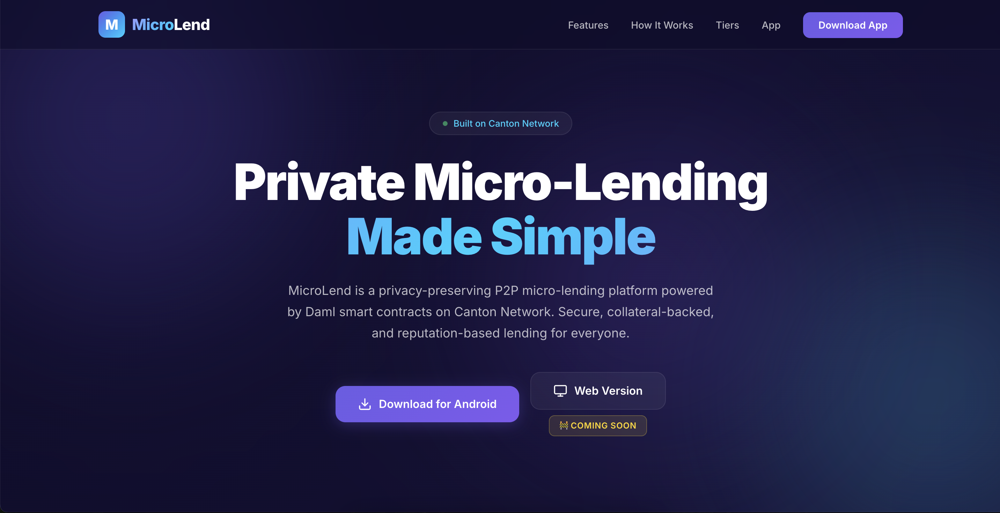
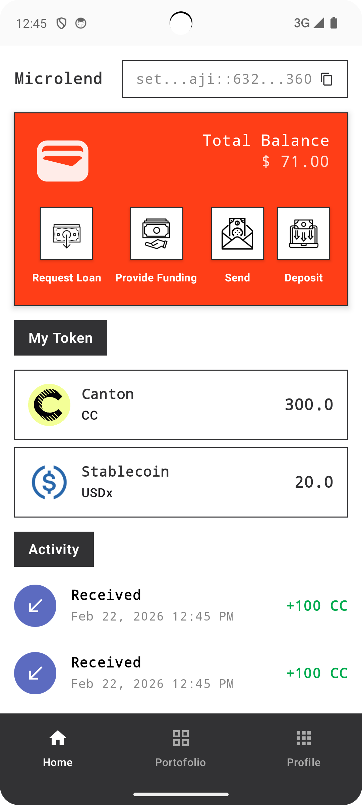
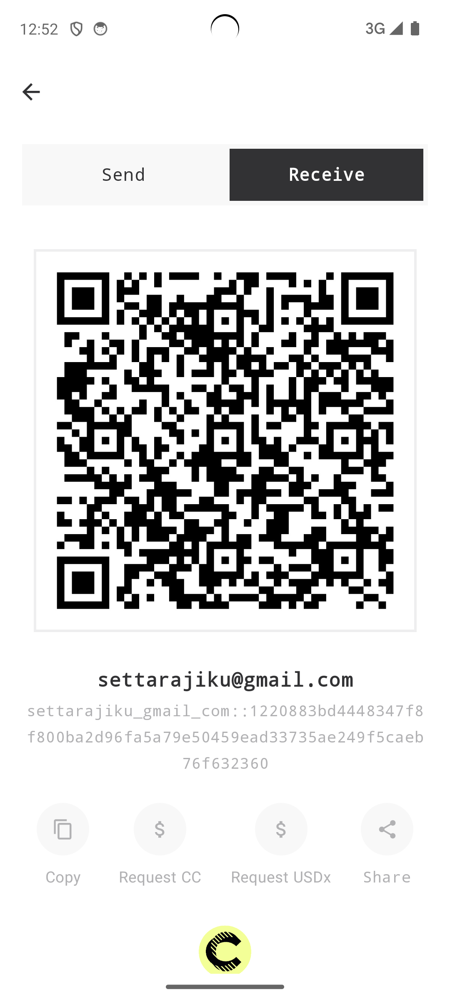
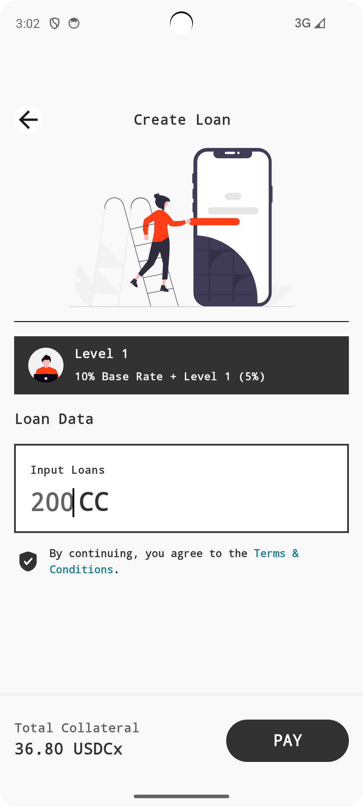
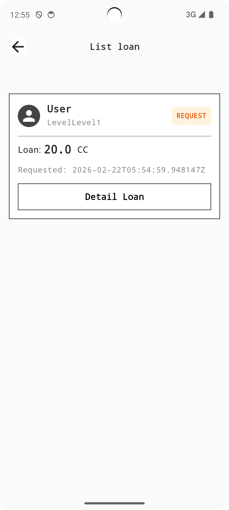
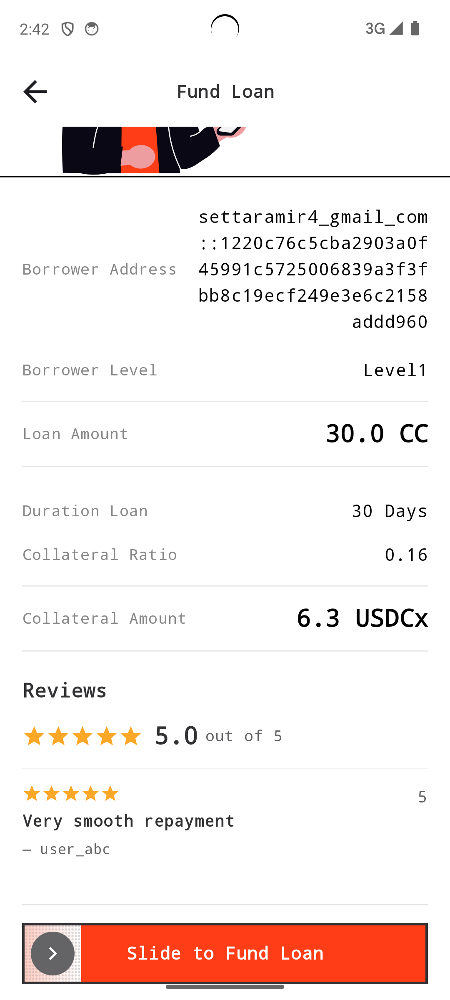
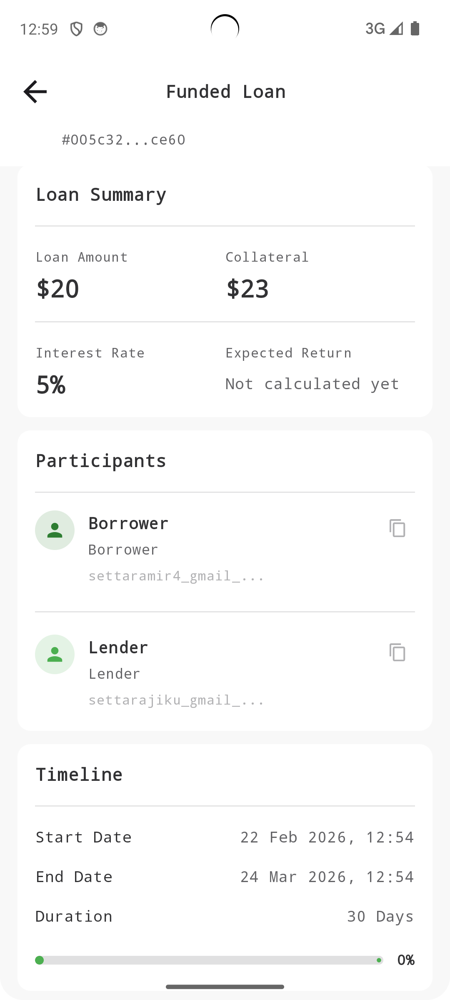
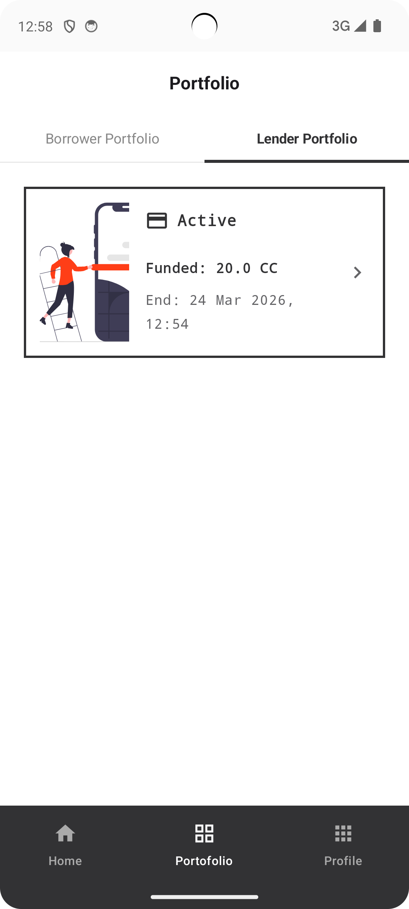
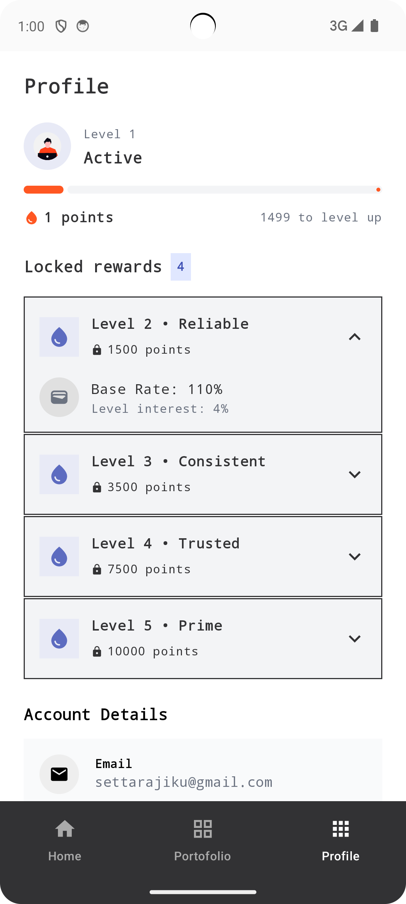

# 🐱 Canton MicroLend

[](https://www.canton.network/)
[](https://www.digitalasset.com/daml)
[]()

> **Private Micro-Lending Made Simple.**

Canton MicroLend is a privacy-preserving P2P micro-lending platform built on the Canton Network. The platform enables borrowers to submit small fixed-rate loan requests with stablecoin (USDx) collateral, while lenders can review and fund them through automated Daml workflows.

**Team:** Kucing Oyen 🐈  
**Mentor:** Ajay Rath  
**Website:** [https://microlend-lac.vercel.app/](https://microlend-lac.vercel.app/)

<p align="center">
  
</p>

---

## 🌟 Overview

Canton MicroLend delivers a micro-lending system that is:
- **Privacy-preserving** — Only involved parties can view loan details
- **Collateral-backed** — Every loan is secured with USDx stablecoin collateral
- **Reputation-based** — 5-level tier system that rewards consistent borrowers
- **Fully automated** — Entire loan lifecycle executed by Daml smart contracts
- **Fully auditable** — All actions are recorded on the ledger

> *"We make P2P micro-lending secure, private, and automated using the Canton Network."*

---

## 🎯 Problem Statement

Real problems faced by small-scale borrowers & lenders:

- ❌ Micro-loans are often tracked manually → unclear status
- ❌ Lack of transparency and audit trails → poor communication, hard to audit
- ❌ High risk for lenders → no collateral or trust signals
- ❌ No incentives for borrowers to build long-term credit reputation
- ❌ Existing solutions fail to effectively combine privacy, automation, and risk-based incentives

**Who faces these issues?**
- Individuals & small communities needing quick micro-loans
- Lenders who want to lend but fear defaults
- The P2P lending market lacking decentralized trust mechanisms

---

## 💡 Solution

### Solution Flow

<p align="center">
  
</p>

### Concept Highlights

- ✅ **Collateral-backed** — Every loan is secured by USDx stablecoin → lenders are protected
- ✅ **Reputation tiering** — 5-level system (Starter → Elite) that lowers collateral requirements as reputation grows
- ✅ **Privacy by design** — Only the involved borrower & lender can view loan details
- ✅ **Fully automated** — Entire loan lifecycle (request → fund → repay/liquidate) is automatically executed by Daml smart contracts
- ✅ **Fair interest system** — Borrowers with good reputations receive benefits without reducing lender yield

---

## 🔄 How It Works

1. **Connect** — Users connect using their Party ID
2. **Create Request** — Borrower creates a loan request (loan amount set, USDx collateral is automatically locked)
3. **Marketplace** — Lenders view all available loan requests along with collateral info & borrower level
4. **Fund** — Lender selects and funds the loan (CC tokens are transferred to the borrower)
5. **Repay** — Borrower repays the loan (principal + interest) → collateral is returned
6. **Complete/Liquidate** — If on time → reputation increases. If defaulted → lender claims the collateral

### Bonus Points
- Collateral rates are adjusted based on borrower level (Level 1: 115%, Level 5: 111%)
- TimeOracle automatically validates due dates
- All actions are recorded on the ledger (complete audit trail)

---

## 🏆 Borrower Tier System

A fair reputation system for **both parties**:

### Tier Structure

| Tier | Level | Collateral Rate | Benefit |
|------|-------|-----------------|---------|
| 🥉 Level 1 | **Starter** | 115% | Baseline, new user |
| 🥈 Level 2 | **Reliable** | 114% | Lower collateral |
| 🥇 Level 3 | **Trusted** | 113% | Highly trusted |
| 💎 Level 4 | **Prime** | 112% | Experienced borrower |
| 👑 Level 5 | **Elite** | 111% | Top-tier, minimum collateral |

### How Does Reputation Change?

- ✅ Every 5 fully paid loans → **level up**
- ❌ Every default → **level down**
- 📈 Score is calculated from: repayment behavior, collateral quality, on-time performance, and loan consistency

### Fairness Guarantee

Lenders always get the same yield. Good borrowers are rewarded with lower collateral rates.

---

## 🛠 Tech Stack

| Layer | Technology |
|-------|------------|
| **Blockchain** | Canton Network (privacy-preserving) |
| **Smart Contracts** | Daml (6 main templates) |
| **Backend** | Spring Boot (Java) + DAML JSON API |
| **Frontend (Web)** | React + TypeScript |
| **Frontend (Mobile)** | Android (Kotlin + Jetpack Compose) |

### 6 DAML Smart Contract Templates

| Template | Function |
|----------|----------|
| **LendingService** | Entry point, orchestration, configuration |
| **LoanRequest** | Marketplace, fill/cancel requests |
| **ActiveLoan** | Repay, liquidate |
| **UserProfile** | Tracks level & reputation history |
| **TimeOracle** | Validates due dates |
| **Holding** | Asset management (CC & USDx tokens) |

### Why Canton?

- **Sub-transaction privacy** — Only involved parties can see the data
- **Daml modeling** — Secure and verifiable business logic
- **Composability** — Ready for integration with other networks via the Canton Protocol

### Architecture

```
Frontend (React / Android) → REST API (Spring Boot) → DAML JSON API → Canton Ledger
                                                          ↕
                  Daml Smart Contracts (LendingService, LoanRequest, ActiveLoan, etc.)
```

---

## 📱 UI

<p align="center">
  
</p>
<p align="center">
  
</p>
<p align="center">
  
</p>
<p align="center">
  
</p>
<p align="center">
  
</p>
<p align="center">
  
</p>
<p align="center">
  
</p>
<p align="center">
  
</p>
<p align="center">
  
</p>

---

## 📈 Progress & Milestones

Improvements during the mentorship program:

- 🔄 **UI Refactoring**
- 📱 **Mobile App** — Built a native Android app with Kotlin + Jetpack Compose (dashboard, portfolio, deposit, lending)
- ⚙️ **Backend API** — Fully implemented REST API for the entire lending lifecycle (15+ endpoints)
- 📜 **Smart Contracts** — 6 production-ready DAML templates (LendingService, LoanRequest, ActiveLoan, UserProfile, TimeOracle, Holding)
- 🏗️ **Architecture** — Clean architecture with separation of concerns (Data → State → View layer)
- 🐛 **Bug Fixes & Improvements** — Database migration, permission handling, KTlint compliance, string localization (ID/EN)
- 📖 **Documentation** — Comprehensive docs (Architecture, API Guide, Quick Reference)

**Timeline:**
> Program Start → Smart Contract Design → Backend API → Web UI Refactor → Android App → Production Ready

---

## 🚀 Roadmap

### Short-term (Q1 2026)
- 🎯 Deploy to Canton DevNet (as recommended by the program)
- 🧪 Testing with partner users in the Canton ecosystem
- 📊 Add an analytics dashboard for platform monitoring

### Mid-term (Q2–Q3 2026)
- 🔄 Integrate with Canton Global Synchronizer for interoperability
- 📱 Release Android app to closed beta
- 🏦 Support multi-asset collateral (not just USDx)
- 🤖 Automated risk scoring with ML-based credit assessment

### Long-term (Q4 2026+)
- 🌐 Production deployment on the Canton Network
- � Scale to more users and asset types
- 🤝 Partnership with financial institutions in the Canton ecosystem
- � Compliance framework for P2P lending regulations

---

## � Team

### Kucing Oyen 🐈
- **Role:** Full-Stack Developer & Project Lead
- **Skills:** Daml Smart Contracts, Spring Boot (Java), Android (Kotlin/Jetpack Compose), React/TypeScript
- **Contribution:** Designed & built the entire stack — from smart contracts to the mobile app

### Ajay Rath
- **Role:** Mentor & Technical Advisor
- **Background:** Canton Network ecosystem expert
- **Contribution:** Guidance on architecture, best practices, and production readiness

---

## 🚀 Getting Started

### Prerequisites

- [Daml SDK](https://docs.daml.com/getting-started/installation.html)
- [Canton](https://www.canton.network/developers)
- Node.js (for frontend)
- JDK 17+ (for backend)
- Android Studio (for mobile app)


<p align="center">
  Built with ❤️ by <strong>Team Kucing Oyen 🐈</strong> on the Canton Network
</p>
